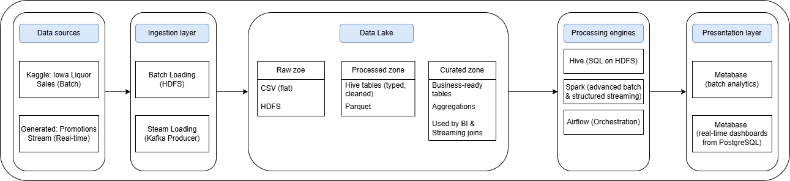

# ASVSP – Arhitektura sistema velikih skupova podataka

## Opis projekta

Projekat je realizovan u okviru predmeta *Arhitektura sistema velikih skupova podataka* i predstavlja kompletno kontejnerizovano Big Data okruženje za obradu podataka u paketnom i realnom vremenu.

Cilj projekta je implementacija savremene arhitekture jezera podataka (Data Lake) sa:
- paketnom obradom (Batch processing),
- obradom tokova podataka (Stream processing),
- orkestracijom procesa,
- analitičkim upitima i vizualizacijom.

---

## Arhitektura sistema

Dijagram kompletne arhitekture sistema prikazan je na sledećoj slici:



Arhitektura obuhvata sledeće slojeve:
- Izvore podataka (batch i streaming)
- Ingestion sloj (HDFS, Kafka)
- Data Lake sa zonama (Raw, Transformed, Curated)
- Procesne motore (Hive, Spark, Spark Structured Streaming)
- Orkestraciju (Airflow)
- Prezentacioni sloj (Metabase)

---

## Skupovi podataka

### Skup I – Paketni podaci (Batch)

- Izvor: Iowa Liquor Sales (Kaggle)
- Veličina: > 3 GB
- Tip: Istorijski podaci o prodaji
- Skladištenje: HDFS (Raw zona)
- Obrada: Hive / Spark SQL

### Skup II – Tok podataka (Streaming)

- Izvor: Generisani tok podataka (promocije, cene, količine)
- Tehnologija: Kafka Producer
- Logički povezan sa batch skupom (store_id, item_id, datum, cena, popust)
- Obrada: Spark Structured Streaming
- Skladištenje rezultata: PostgreSQL / Metabase

---

## Pokretanje sistema (Cluster)

Sistem se pokreće iz root direktorijuma projekta preko skripte `cluster_up.sh`.  
Skripta automatski kreira Docker network `asvsp` i podiže tražene servise koristeći odgovarajuće `docker-compose.yml` fajlove iz podfoldera.

### Pokretanje servisa

U root folderu projekta pokreni:

```bash
./scripts/cluster_up.sh hdfs hive spark airflow hue metabase kafka data_generator locust simple_kafka_consumer


